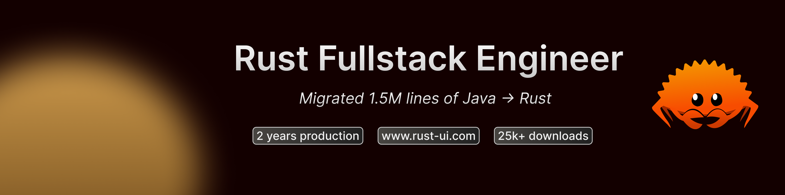

<h2>Hi, I'm Max 👋</h2>

  
  
  

Rust fullstack engineer with two years of production experience. Migrated a 1.5M+ line Java codebase to Rust on-site in Dubai, covering backend services, architecture redesign, and frontend components. Previously rebuilt a large-scale sustainability platform in TypeScript. Maintainer of rust-ui.com, a component registry with thousands of production users, and an icons crate with 25k+ downloads.

<h2 align="center">Some of my favorite projects</h2>
 

  
  

<h2 align="center">About me 🦀</h2>

<b>Timezone: Europe/Paris (CET)</b>

In my latest project, I built [rust-ui.com](https://rust-ui.com), a component registry for fullstack Rust applications that you can copy/paste into your own codebase. Used by thousands of developers in production.

🔸 Currently maintaining: Rust/UI — a component registry for fullstack Rust used by thousands of developers in production, and an icons crate with 25k+ downloads 
🔸 Specialty: Rust backend & fullstack — REST APIs, async Rust, WASM, system architecture, and large-scale codebase migrations (1.5M+ lines Java → Rust) 
🔸 Blockchain: built an NFT marketplace on Solana in Rust 
🔸 Looking to collaborate on: production Rust projects, backend systems, and open-source Rust ecosystem contributions 
🔸 Ask me about: Rust fullstack & backend architecture, migrating legacy codebases to Rust, AI agent orchestration 
🔸 Jury's Favorite — Blockchain Hackathon, Vierzon (2024)

 

<h2 align="center">⚒️ Languages-Frameworks-Tools ⚒️</h2>
 

    
   
     

 

 <picture>
  <source
    media="(prefers-color-scheme: dark)"
    srcset="https://raw.githubusercontent.com/max-wells/max-wells/output/github-snake-dark.svg"
  />
  <source
    media="(prefers-color-scheme: light)"
    srcset="https://raw.githubusercontent.com/max-wells/max-wells/output/github-snake.svg"
  />
  
</picture>

 
 

  

 
